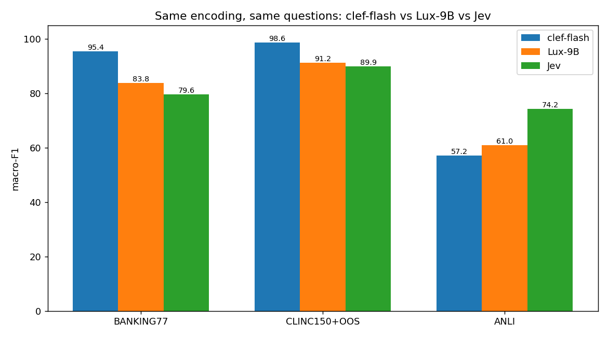

# Three-way decision model benchmark: clef-flash vs Lux-9B vs Jev

All three models answered the identical 11,780 questions (BANKING77 3,080 · CLINC150+OOS 5,500 · ANLI 3,200)
with identical question encodings, serial protocol (concurrency=1), October 3, 2026.

- **clef-flash** — Cloudflare/clef-flash self-hosted on the NVIDIA GB10 (DGX Spark), hardened FastAPI server
- **Lux-9B** — vllm-sr/Decision-2.0-Lux-9B self-hosted on the same GB10 (transformers, vendor runtime)
- **Jev** — typesafe/jev-1.13 via OpenRouter decisions API (cloud; probabilities quantized to 2 decimals)

## Headline results

| Dataset | Model | macro-F1 | accuracy | OOS recall | p50 | p95 | conf ok/wrong |
| --- | --- | ---: | ---: | ---: | ---: | ---: | --- |
| BANKING77 | clef-flash (GB10 local) | **95.41** | 95.42 | - | 551.0ms | 560.5ms | 0.94 / 0.69 |
| BANKING77 | Lux-9B (GB10 local) | **83.80** | 84.29 | - | 612.6ms | 617.3ms | 0.92 / 0.77 |
| BANKING77 | Jev (OpenRouter cloud) | **79.61** | 80.36 | - | 186.8ms | 273.1ms | 0.93 / 0.72 |
| CLINC150+OOS | clef-flash (GB10 local) | **98.60** | 98.22 | 93.9% | 918.4ms | 924.6ms | 0.95 / 0.71 |
| CLINC150+OOS | Lux-9B (GB10 local) | **91.16** | 89.20 | 67.8% | 1056.8ms | 1060.2ms | 0.91 / 0.76 |
| CLINC150+OOS | Jev (OpenRouter cloud) | **89.87** | 89.71 | 87.3% | 186.7ms | 279.3ms | 0.95 / 0.74 |
| ANLI | clef-flash (GB10 local) | **57.18** | 57.53 | - | 112.4ms | 115.7ms | 0.75 / 0.68 |
| ANLI | Lux-9B (GB10 local) | **61.00** | 61.06 | - | 119.0ms | 137.5ms | 0.59 / 0.47 |
| ANLI | Jev (OpenRouter cloud) | **74.16** | 73.97 | - | 177.8ms | 272.5ms | 0.81 / 0.62 |

## Harness validation: local Jev reproduces the published Decision Index

| Task | Jev published | Jev (this run) | delta |
| --- | ---: | ---: | ---: |
| BANKING77 | 79.74 | 79.61 | -0.13 |
| CLINC150+OOS | 89.27 | 89.87 | +0.60 |
| ANLI | 74.8 | 74.16 | -0.64 |

Local Jev lands within 0.6 points of the published numbers on all three tasks — the encodings and
harness are faithful. Consequence: where our local clef-flash diverges from its published row
(BANKING77 90.93→95.41, CLINC150 66.77→98.6), the difference is the encoding, not measurement noise.
The three-way table above is the apples-to-apples comparison; published rows are context only.

## BANKING77

- **clef-flash (GB10 local)**: macro-F1 95.41, Brier 0.0749, ECE 0.0302 — top confusions: fiat_currency_support→exchange_via_app (7); balance_not_updated_after_bank_transfer→transfer_timing (5); card_delivery_estimate→card_arrival (4)
- **Lux-9B (GB10 local)**: macro-F1 83.80, Brier 0.2328, ECE 0.0586 — top confusions: order_physical_card→get_physical_card (28); get_physical_card→change_pin (13); beneficiary_not_allowed→declined_transfer (13)
- **Jev (OpenRouter cloud)**: macro-F1 79.61, Brier 0.3053, ECE 0.0852 — top confusions: get_physical_card→change_pin (34); order_physical_card→get_physical_card (27); beneficiary_not_allowed→failed_transfer (16)

## CLINC150+OOS

- **clef-flash (GB10 local)**: macro-F1 98.60, Brier 0.0302, ECE 0.0357 — top confusions: oos→order (8); oos→directions (6); oos→travel_suggestion (6)
- **Lux-9B (GB10 local)**: macro-F1 91.16, Brier 0.1737, ECE 0.0554 — top confusions: oos→definition (39); oos→smart_home (26); oos→time (19)
- **Jev (OpenRouter cloud)**: macro-F1 89.87, Brier 0.1592, ECE 0.0301 — top confusions: reminder_update→reminder (30); accept_reservations→restaurant_reservation (28); distance→directions (20)

## ANLI

- **clef-flash (GB10 local)**: macro-F1 57.18, Brier 0.5792, ECE 0.1439 — by round: test_r1: 65.28, test_r2: 57.76, test_r3: 49.86 — top confusions: entailment→neutral (350); contradiction→neutral (344); contradiction→entailment (239)
- **Lux-9B (GB10 local)**: macro-F1 61.00, Brier 0.5720, ECE 0.1585 — by round: test_r1: 68.82, test_r2: 59.26, test_r3: 55.87 — top confusions: neutral→contradiction (350); entailment→neutral (288); contradiction→entailment (189)
- **Jev (OpenRouter cloud)**: macro-F1 74.16, Brier 0.3794, ECE 0.0928 — by round: test_r1: 81.47, test_r2: 73.28, test_r3: 68.70 — top confusions: entailment→neutral (297); contradiction→neutral (260); neutral→contradiction (101)

## Latency context (read before comparing)

| Model | where | p50 (small schema, ANLI) | p50 (77 options) | p50 (151 options) |
| --- | --- | ---: | ---: | ---: |
| clef-flash | GB10 local | 112.4ms | 551.0ms | 918.4ms |
| Lux-9B | GB10 local | 119.0ms | 612.6ms | 1056.8ms |
| Jev | cloud (network RTT included) | 177.8ms | 186.8ms | 186.7ms |

- Published Decision Index latencies (their infra): clef-flash 38.8ms, Jev 524.1ms, Clef 27B 209.3ms median.
- Jev via OpenRouter (187ms median here) is served by TypeSafe's inference infra — faster than the
  published 524ms and faster than a hobby-box GPU on large schemas; that is infrastructure, not model speed.
- On the same GB10, Lux-9B runs ~10% slower than clef-flash at every schema size (no fused kernels on
  NVIDIA — its Triton kernels are ROCm-only).

## Appendix: published Jev Decision Index rows (context only, different encodings)

| Benchmark | Clef 27B | Clef-flash 9B | Jev | DiffusionGemma Jev | Kev 9B | Laya | **This run (best local)** |
| --- | ---: | ---: | ---: | ---: | ---: | ---: | ---: |
| BANKING77 (macro-F1) | 94.2 | 90.93 | 79.74 | 74.28 | 84.83 | 14.29 | **95.41** |
| CLINC150+OOS (macro-F1) | 97.43 | 66.77 | 89.27 | 83.49 | 79.03 | 3.19 | **98.60** |
| ANLI (macro-F1) | 69.8 | 59.1 | 74.8 | 66.4 | 56.3 | 48.7 | **74.80** |
